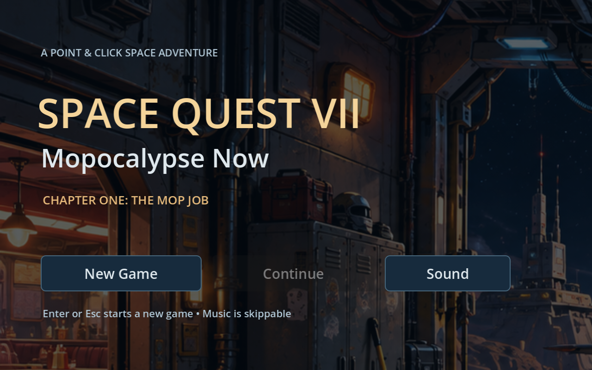

# Space Quest VII — Mopocalypse Now

A playable, original 2D point-and-click adventure chapter inspired by the comic science-fiction storytelling of Space Quest. **Chapter one: The Mop Job** uses detailed illustrated room backgrounds and a modern widescreen interface. Click objects to interact, people to talk, and the floor to walk; inventory puzzles and dialogue drive the story.

This build covers **three connected rooms**: the Orbital Diner (Astro-Burger), Service Dock 7, and the Arcada Memorial Museum. It is an opening chapter with its own puzzle sequence and departure ending. The larger sixteen-room adventure in the original concept is still future work. The room artwork and in-game soundtrack are original. The title screen now uses the supplied SQ5 fanfare and SQ6 intro recording.




## Play on Windows

1. [Download this repository as a ZIP](https://github.com/vernlouw/SQ/archive/refs/heads/main.zip) and extract it.
2. Open **Godot 4.4.1**, choose **Import** in the Project Manager, and select the extracted folder's `project.godot`.
3. Open the imported project and press **F5** to play. The title screen opens first; choose **New Game** or **Continue**.

Import this project directly. Avoid copying its contents into an existing Godot project. This download is source code; a standalone Windows executable is not included. Playing requires no external services, credentials, or additional assets.

## Controls

- On the **title screen**, choose **New Game** to begin or **Continue** to restore your saved chapter. **Enter** or **Esc** skips the title music and starts a new adventure. **Sound** opens volume controls.
- **Left-click the floor** to walk automatically, even while an inventory item or optional action is selected.
- **Left-click a person or object** to approach and perform its usual action: talk, inspect, pick up, operate, or travel through a doorway.
- **Select an inventory item**, then click its target to use it there. Select one inventory item, then click another to combine them.
- **Right-click an object** to inspect it. **Right-click empty floor** or press **Esc** to clear an item or action selection and return to automatic interactions.
- Optional **Look, Use, Talk** buttons choose a specific action. Click the active button again to return to automatic interactions. Keyboard: **1** automatic interaction, **2** Look, **3** Use, **4** Talk.
- **Tab**: show hotspot hints. **I**: inventory hint.
- **Sound** (bottom right) or **M**: adjust music, sound effects, and room ambience, or mute all audio. **Esc** closes sound options. Volume and mute preferences save automatically and survive restarting the game.
- **F5**: save progress. **F9**: load progress. Use the on-screen controls to save, load, or start a new game too.

There is one local save slot, stored in Godot's per-user application data directory rather than in the project folder. Starting a new game resets the current chapter; loading restores the saved progress.

## Sound

The chapter now includes an **original retro science-fiction soundtrack**, three looping room ambiences, and effects for footsteps, pickups, doors, terminals, inventory combinations, puzzle success, and saving/loading. Roger's footsteps stop while dialogue or sound options are open. Each room has its own score and ambience; changing rooms replaces the previous loops.

The room music and effects evoke the synthesizer-era adventure-game feel and were newly synthesized for this project. The playable chapter text has no voice-over; advancing it plays a quiet interface cue. The supplied intro recording may contain its original recorded voices.

If you have actual sound recordings you want to use locally, matching WAV or OGG files in [`assets/audio/custom`](assets/audio/custom/README.md) override individual cues. Files not supplied continue using the included original audio. No game resource archives or emulator DLLs need to be copied into this Godot project.

The title plays the supplied **SQ5 opening fanfare** (about 19 seconds), followed by the full **SQ6 intro recording** (about 5 minutes 33 seconds). These recordings received a light loudness and EQ remaster; their music and full running times are preserved. This is a remaster of the supplied recordings, rather than a newly performed arrangement. Both play once. Choosing New Game or Continue, or pressing Enter or Esc, skips the remaining title music and starts the room score. Finishing the music leaves the title menu open.

Local `intro_fanfare.wav`/`.ogg` and `intro_theme.wav`/`.ogg` files can override the title recordings too. If one cue is unavailable, the other still plays; if both are unavailable, the title remains usable without music.

## Walkthrough (spoilers)

1. At Astro-Burger, click the news screen, then click the cook. Get a service chit and permission to take the grease.
2. Click the grease jar to pick it up. Select the grease in your inventory and click the maintenance panel to repair the hatch. Click the doorway to enter the dock.
3. Give the service chit to the dock guard to receive a keycard and maintenance pass.
4. Use the keycard on the locker to collect the cleaner and release the mop's magnetic lock. Click the mop leaning beside the locker to pick it up. Use the keycard on the terminal to authorize museum access, then click the museum lift.
5. Talk to the guardian for a clue. Use your maintenance pass on the guardian to enable cleaning mode.
6. Combine the cleaner and mop in your inventory. Use the charged mop on the spill to clear the floor, then click the plinth to collect the star map.
7. Click the museum exit to return to the dock. Use the star map on the terminal to set the coordinates, then click the shuttle to finish the chapter.

## Development and verification

The project targets Godot **4.4.1** with its Compatibility renderer. Validation on Linux includes a clean project import, **88 gameplay checks and 259 audio checks passing**, and visually inspected graphical captures of all three rooms and portrait dialogue. Run these from the project folder, substituting the path to your Godot executable:

```sh
/path/to/Godot --headless --editor --path . --quit
/path/to/Godot --headless --path . --script tests/smoke.gd
/path/to/Godot --headless --audio-driver Dummy --path . --script tests/audio_smoke.gd
```

Use a separate `XDG_DATA_HOME` directory when running either smoke test on Linux; they exercise the game's save slot and saved audio preferences. The test checks automatic floor movement and object actions, optional verbs, inspection and cancellation, blocked pickups, item combinations and consumption, all three rooms, the ending, and saving/loading/resetting progress. It also checks compatibility with earlier saves that granted the mop directly from the locker. Input checks send real mouse and keyboard events through the interface and world hotspots. The audio test additionally checks decoded WAV samples, room loop replacement, actual nonzero PCM from Godot's software mixer and silence while muted, alternating footsteps, real puzzle-event cues without duplicates, local sound overrides, saved volume/mute preferences, modal input handling, the actual supplied WAV/Vorbis recording durations and decoded samples, title menu input/Continue, and title sequence order/skip/completion using short temporary synthetic fixtures. Mixer capture verifies software playback; it does not test a physical speaker device.

`tests/capture.gd` is an optional screenshot helper and requires a graphical display:

```sh
/path/to/Godot --path . --script tests/capture.gd -- --room=diner --output=/tmp/diner.png
```

Capture room IDs are `diner`, `dock`, and `museum`. Use `--title` to capture the title screen and add `--sound` to include sound options. Omit `--output` to write `capture_<room>.png` or `capture_title.png` to the local user-data directory.

## Current scope

Included: three illustrated rooms, automatic floor walking and contextual object interactions, optional Look/Use/Talk actions, dialogue, world pickups, inventory selection and combination, a connected puzzle chain, blocked progression with hints, a chapter ending, local save/load/new game, room music and ambience, contextual sound effects, persistent audio controls, and a skippable title screen with the supplied SQ5/SQ6 recordings.

Still to build: the remaining story locations, a full adventure finale, richer character animation, a longer original score, voiced dialogue, death sequences, the burger minigame, and a tested standalone Windows export. The artwork is original and AI-assisted; character animation remains simpler than the backgrounds. This chapter provides a working basis for expanding and polishing the adventure.
