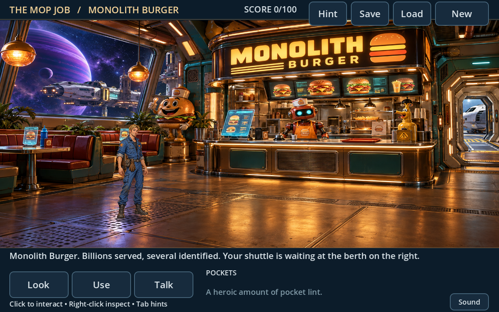
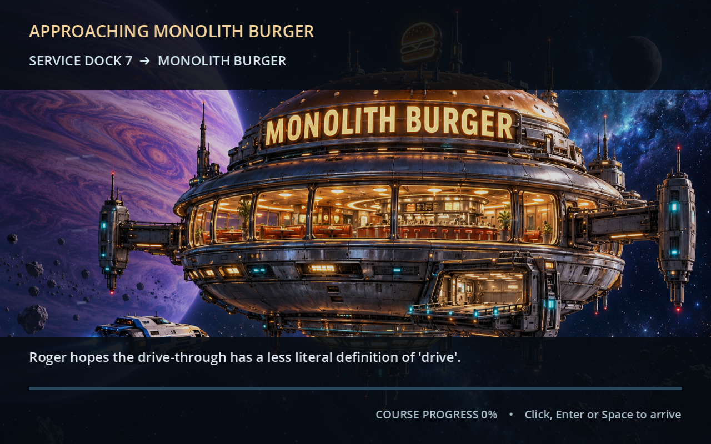
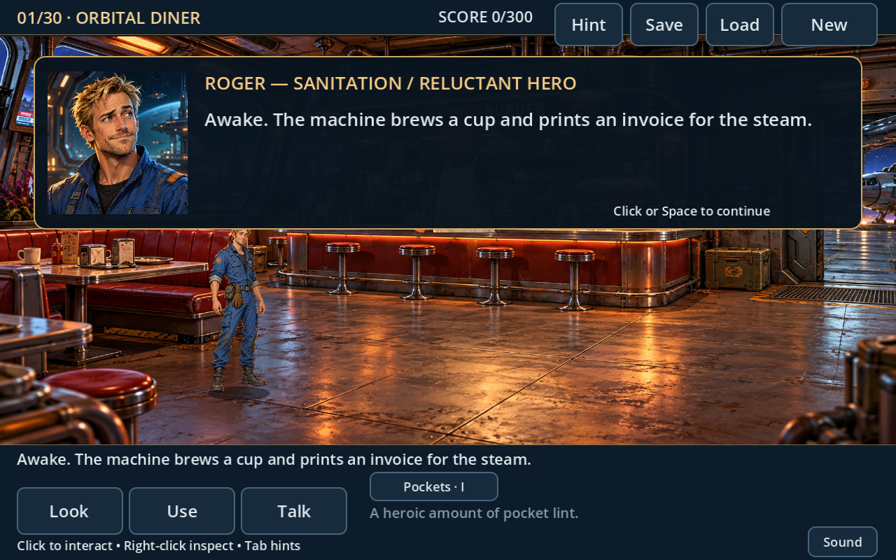
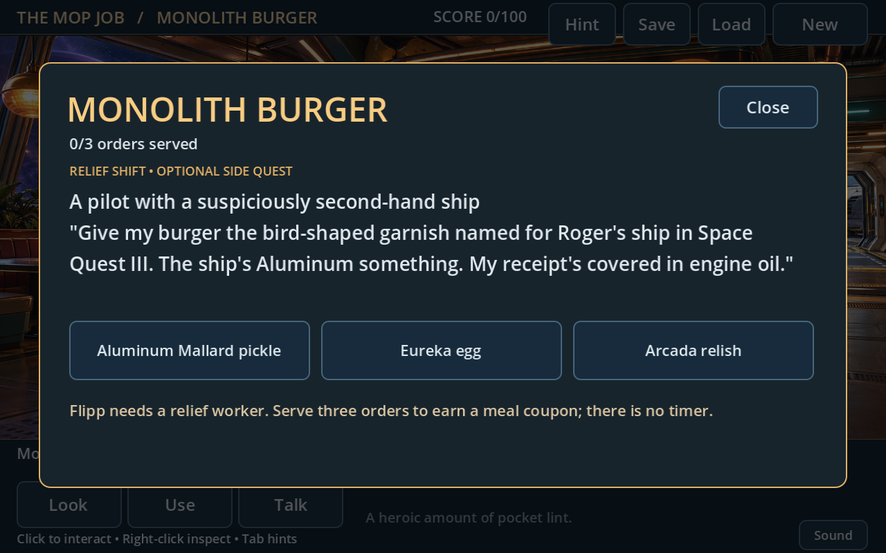

# Space Quest VII — Mopocalypse Now

A playable, original 2D point-and-click adventure chapter inspired by the comic science-fiction storytelling of Space Quest. **Chapter one: The Mop Job** uses detailed illustrated room backgrounds and a modern widescreen interface. Click objects to interact, people to talk, and the floor to walk; inventory puzzles and dialogue drive the story.

This build covers **four playable rooms**: the Orbital Diner (Astro-Burger), Service Dock 7, the Arcada Memorial Museum, and Monolith Burger. Board the dock shuttle, choose Monolith Burger, and take a short illustrated flight to its restaurant; fly back when you are ready to continue the main mission. It is an opening chapter with its own puzzle sequence and departure ending. The larger sixteen-room adventure in the original concept is still future work. The room artwork and in-game soundtrack are original. The title screen now uses the supplied SQ5 fanfare and SQ6 intro recording.










## Play on Windows

1. [Download the Windows game ZIP](https://github.com/vernlouw/SQ/releases/latest/download/SpaceQuestVII-Windows.zip).
2. Extract the entire ZIP into a folder.
3. Double-click **SpaceQuestVII.exe**.
4. Choose **New Game** or **Continue** on the title screen.

Godot is not required for this download. Artwork, music, and game data are embedded in the executable. The export targets Windows 10/11 on x86-64, with an OpenGL 3.3 graphics driver. Playing requires no external services or credentials.

## Controls

- On the **title screen**, choose **New Game** to begin or **Continue** to restore your saved chapter. **Enter** or **Esc** skips the title music and starts a new adventure. **Sound** opens volume controls.
- **Left-click the floor** to walk automatically, even while an inventory item or optional action is selected.
- **Left-click a person or object** to approach and perform its usual action: talk, inspect, pick up, operate, or travel through a doorway.
- **Select an inventory item**, then click its target to use it there. Select one inventory item, then click another to combine them. Click the selected item again to deselect it.
- **Right-click an object** to inspect it. **Right-click empty floor** or press **Esc** to clear an item or action selection and return to automatic interactions.
- Optional **Look, Use, Talk** buttons choose a specific action. Talk applies to characters; objects keep their normal contextual action when Talk is selected. Click the active button again to return to automatic interactions. Keyboard: **1** automatic interaction, **2** Look, **3** Use, **4** Talk.
- **Shuttle travel:** click the dock shuttle to choose Monolith Burger or, once its coordinates are programmed, Labion. Click the restaurant berth to fly back to the dock. **Cancel** or **Esc** closes navigation; **click, Enter, or Space** skips the short flight to arrival.
- **Tab**: show hotspot hints. **I**: inventory hint.
- **Sound** (bottom right) or **M**: adjust music, sound effects, and room ambience, or mute all audio. **Esc** closes sound options. Volume and mute preferences save automatically and survive restarting the game.
- **F5**: save progress. **F9**: load progress. Use the on-screen controls to save, load, or start a new game too.

There is one local save slot, stored in Godot's per-user application data directory rather than in the project folder. Starting a new game resets the current chapter; loading restores the saved progress. Save from a playable room; navigation and flight must finish or close before saving. Loading or starting a new game cancels any unfinished flight.

## Sound

The chapter now includes an **original retro science-fiction soundtrack**, four looping room ambiences, and effects for footsteps, pickups, doors, terminals, inventory combinations, puzzle success, and saving/loading. Roger's footsteps stop while dialogue, menus, or flight are active. Each room has its own score and ambience; changing rooms replaces the previous loops.

The room music and effects evoke the synthesizer-era adventure-game feel and were newly synthesized for this project. The playable chapter text has no voice-over; advancing it plays a quiet interface cue. The supplied intro recording may contain its original recorded voices.

If you have actual sound recordings you want to use locally, matching WAV or OGG files in [`assets/audio/custom`](assets/audio/custom/README.md) override individual cues. Files not supplied continue using the included original audio. No game resource archives or emulator DLLs need to be copied into this Godot project.

The title plays the supplied **SQ5 opening fanfare** (about 19 seconds), followed by the full **SQ6 intro recording** (about 5 minutes 33 seconds). These recordings received a light loudness and EQ remaster; their music and full running times are preserved. This is a remaster of the supplied recordings, rather than a newly performed arrangement. Both play once. Choosing New Game or Continue, or pressing Enter or Esc, skips the remaining title music and starts the room score. Finishing the music leaves the title menu open.

Local `intro_fanfare.wav`/`.ogg` and `intro_theme.wav`/`.ogg` files can override the title recordings too. If one cue is unavailable, the other still plays; if both are unavailable, the title remains usable without music.

## Explore for fun

The rooms now have **19 extra objects** with optional jokes, repeat responses, and small visual reactions. These sit alongside the chapter's main puzzles:

- **Diner:** brew suspicious coffee, inspect the Monolith Burger advertisement, negotiate with a sticky seat, rotate the window plant, and shake rocket sauce.
- **Dock:** rattle cargo cases, try the spare helmet, peel a safety marking, knock on the ventilation, and inspect or wave at the gas giant.
- **Museum:** cycle the inspection scope's filters, light the mop blueprint, request a donor tour, run the starship model, and take a free souvenir badge.
- **Monolith Burger:** press the mascot, zoom the booth holomenu, pump the mustard duck, and admire the view.

Right-click to inspect; left-click props to perform their usual action. **Talk** is for people. Repeat uses can change settings or give another response. **Tab** outlines every available target. The souvenir badge appears in your pockets; show it to Bex, Voss, the archive guardian, or Flipp for their reactions.

The optional settings and repeat history save with your checkpoint. These interactions add flavor while the chapter's story score remains out of 100. Your puzzle items stay in your pockets when an optional object has no use for them. Short visual effects pause while you read their dialogue and fade after you dismiss it.

## Monolith Burger relief shift

At Service Dock 7, click the shuttle and choose **Fly to Monolith Burger**. Its local route is available before you recover the museum map. After landing, talk to **Flipp**, then click the restaurant's order terminal or counter to open an optional three-order job. Each customer asks for a meal choice linked to Roger's adventures in SQ3, SQ4, or SQ5. Choose from the three buttons; a wrong answer gives a hint and another try. There is no timer.

Finish all three tickets to earn one **COUPON**. Select it in your pockets and click Flipp to claim the staff meal. Closing the order window or pressing **Esc** keeps your progress, and saved games restore the current ticket and reward history. The job stays completed after redemption, so it cannot produce extra coupons. The berth on the restaurant's right opens the return flight to Service Dock 7. Flights preserve your pockets, puzzle progress, optional settings, and order history. The chapter's main puzzles and /100 score continue independently.

## Walkthrough (spoilers)

1. At Astro-Burger, click the news screen, then click the cook. Get a service chit and permission to take the grease.
2. Click the grease jar to pick it up. Select the grease in your inventory and click the maintenance panel to repair the hatch. Click the doorway to enter the dock.
3. Give the service chit to the dock guard to receive a keycard and maintenance pass.
4. Use the keycard on the locker to collect the cleaner and release the mop's magnetic lock. Click the mop leaning beside the locker to pick it up. Use the keycard on the terminal to authorize museum access, then click the museum lift.
5. Talk to the guardian for a clue. Use your maintenance pass on the guardian to enable cleaning mode.
6. Combine the cleaner and mop in your inventory. Use the charged mop on the spill to clear the floor, then click the plinth to collect the star map.
7. Click the museum exit to return to the dock. Use the star map on the terminal to set the coordinates, then click the shuttle, choose **Set course for Labion**, and arrive to finish the chapter. Monolith Burger remains an optional side trip; it is a playable restaurant, while Labion is the chapter's departure ending.

## Development and verification

To work with the editable source, [download the repository ZIP](https://github.com/vernlouw/SQ/archive/refs/heads/main.zip) and extract it. Open **Godot 4.4.1**, choose **Import**, select `project.godot`, then open the project and press **F5**. Keep the `assets` and `scripts` folders beside `project.godot`; import this folder as its own project.

The project targets Godot **4.4.1** with its Compatibility renderer. Validation on Linux includes a clean project import, **88 gameplay checks, 274 audio checks, 312 optional room checks, 81 burger checks, and 78 travel checks passing**, and visually inspected graphical captures of all four rooms, the flight/navigation screens, and portrait dialogue. The x86-64 Windows export and its embedded artwork, music, and startup were checked, including loading the packed game through Godot on Linux. Native Windows launch remains unverified. Run these from the project folder, substituting the path to your Godot executable:

```sh
/path/to/Godot --headless --editor --path . --quit
/path/to/Godot --headless --path . --script tests/smoke.gd
/path/to/Godot --headless --audio-driver Dummy --path . --script tests/audio_smoke.gd
/path/to/Godot --headless --audio-driver Dummy --path . --script tests/room_bits_smoke.gd
/path/to/Godot --audio-driver Dummy --path . --script tests/burger_shift_smoke.gd
/path/to/Godot --headless --audio-driver Dummy --path . --script tests/travel_smoke.gd
```

Use a separate `XDG_DATA_HOME` directory when running any smoke test on Linux; they exercise the game's save slot and saved audio preferences. The test checks automatic floor movement and object actions, optional verbs, inspection and cancellation, blocked pickups, item combinations and consumption, the original three-room puzzle chain, the ending, and saving/loading/resetting progress. It also checks compatibility with earlier saves that granted the mop directly from the locker. Input checks send real mouse and keyboard events through the interface and world hotspots. The audio test additionally checks decoded WAV samples, room loop replacement, actual nonzero PCM from Godot's software mixer and silence while muted, alternating footsteps, real puzzle-event cues without duplicates, local sound overrides, saved volume/mute preferences, modal input handling, the actual supplied WAV/Vorbis recording durations and decoded samples, title menu input/Continue, and title sequence order/skip/completion using short temporary synthetic fixtures. Mixer capture verifies software playback; it does not test a physical speaker device. The optional-room suite checks mouse reachability of story and extra targets, read-only inspections, repeat outcomes, wrong-item preservation, badge pickup and NPC reactions, saved toggles and older checkpoints, character-only Talk behavior, modal input blocking, and visual-effect lifetime. The burger suite checks real menu and option clicks, wrong-order retries, a single reward and redemption, retained/saved progress, modal pausing, and choice/inventory layout. The travel suite checks actual shuttle/route clicks, the fourth room, outbound and return flight, locked/unlocked Labion, flight skipping, world-input blocking, single-item deselection, restaurant reward/redemption, preserved puzzle progress, restaurant checkpoints and old saves, and the original 100-point ending after a side trip.

The burger suite requires a graphical display because it verifies actual text and button geometry. On Linux CI, use X11 or `xvfb-run -a env LIBGL_ALWAYS_SOFTWARE=1 /path/to/Godot --audio-driver Dummy --path . --script tests/burger_shift_smoke.gd`. Godot's Dummy renderer reports different vertical font metrics, so this suite rejects `--headless`. The other four suites run headlessly.

`tests/capture.gd` is an optional screenshot helper and requires a graphical display:

```sh
/path/to/Godot --path . --script tests/capture.gd -- --room=diner --output=/tmp/diner.png
```

Capture room IDs are `diner`, `dock`, `museum`, and `monolith`. Use `--title` to capture the title screen and add `--sound` to include sound options. `--burger` opens the optional relief-shift popup in `monolith`. Use `--travel` in `dock` or `monolith` for navigation, or `--flight` for the local flight screen. `--portrait` shows the current room's character, including Flipp in `monolith`. `--bits` shows hotspot outlines; `--interact=bit_coffee` (or another room interaction ID) captures its response and visual effect. Omit `--output` to write `capture_<room>.png` or `capture_title.png` to the local user-data directory.

## Current scope

Included: four illustrated playable rooms, automatic floor walking and contextual object interactions, optional Look/Use/Talk actions, dialogue, world pickups, inventory selection and combination, a connected puzzle chain, blocked progression with hints, a chapter ending, local save/load/new game, room music and ambience, contextual sound effects, persistent audio controls, a skippable title screen with the supplied SQ5/SQ6 recordings, and nineteen optional room interactions with repeat jokes, saved toggles, visual reactions, a souvenir badge, and the optional three-order Monolith Burger job with a redeemable staff-meal coupon, selectable shuttle destinations, and short illustrated outbound/return flights. Labion is the main mission's flight and chapter ending; its playable surface is future work.

Still to build: the remaining story locations, a full adventure finale, richer character animation, a longer original score, voiced dialogue, death sequences, and native Windows verification of the standalone export. The artwork is original and AI-assisted; character animation remains simpler than the backgrounds. This chapter provides a working basis for expanding and polishing the adventure.
