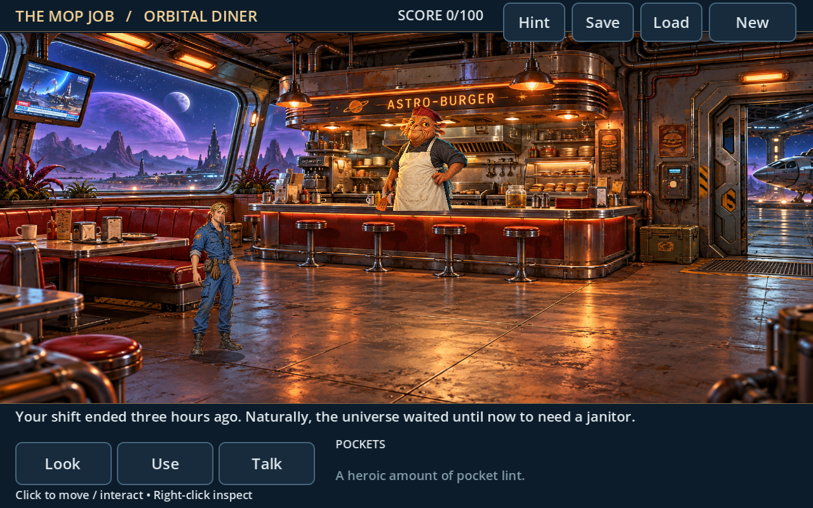
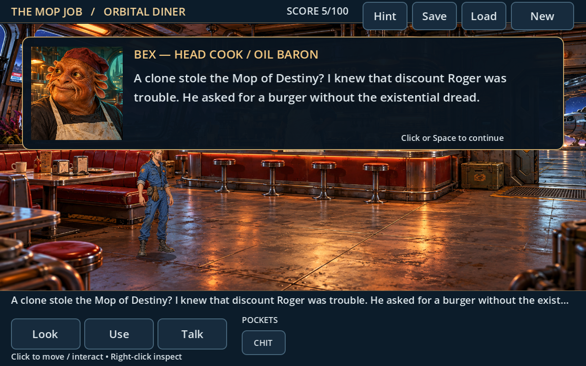

# Space Quest VII — Mopocalypse Now

A playable, original 2D point-and-click adventure chapter inspired by the comic science-fiction storytelling of Space Quest. **Chapter one: The Mop Job** uses detailed illustrated room backgrounds and a modern widescreen interface. Click objects to interact, people to talk, and the floor to walk; inventory puzzles and dialogue drive the story.

This build covers **three connected rooms**: the Orbital Diner (Astro-Burger), Service Dock 7, and the Arcada Memorial Museum. It is an opening chapter with its own puzzle sequence and departure ending. The larger sixteen-room adventure in the original concept is still future work. No artwork, audio, or files from Sierra's games are included.





## Play on Windows

1. [Download this repository as a ZIP](https://github.com/vernlouw/SQ/archive/refs/heads/main.zip) and extract it.
2. Open **Godot 4.4.1**, choose **Import** in the Project Manager, and select the extracted folder's `project.godot`.
3. Open the imported project and press **F5** to play.

Import this project directly. Avoid copying its contents into an existing Godot project. This download is source code; a standalone Windows executable is not included. Playing requires no external services, credentials, or additional assets.

## Controls

- **Left-click the floor** to walk automatically, even while an inventory item or optional action is selected.
- **Left-click a person or object** to approach and perform its usual action: talk, inspect, pick up, operate, or travel through a doorway.
- **Select an inventory item**, then click its target to use it there. Select one inventory item, then click another to combine them.
- **Right-click an object** to inspect it. **Right-click empty floor** or press **Esc** to clear an item or action selection and return to automatic interactions.
- Optional **Look, Use, Talk** buttons choose a specific action. Click the active button again to return to automatic interactions. Keyboard: **1** automatic interaction, **2** Look, **3** Use, **4** Talk.
- **Tab**: show hotspot hints. **I**: inventory hint.
- **F5**: save progress. **F9**: load progress. Use the on-screen controls to save, load, or start a new game too.

There is one local save slot, stored in Godot's per-user application data directory rather than in the project folder. Starting a new game resets the current chapter; loading restores the saved progress.

## Walkthrough (spoilers)

1. At Astro-Burger, click the news screen, then click the cook. Get a service chit and permission to take the grease.
2. Click the grease jar to pick it up. Select the grease in your inventory and click the maintenance panel to repair the hatch. Click the doorway to enter the dock.
3. Give the service chit to the dock guard to receive a keycard and maintenance pass.
4. Use the keycard on the locker to collect the cleaner and release the mop's magnetic lock. Click the mop leaning beside the locker to pick it up. Use the keycard on the terminal to authorize museum access, then click the museum lift.
5. Talk to the guardian for a clue. Use your maintenance pass on the guardian to enable cleaning mode.
6. Combine the cleaner and mop in your inventory. Use the charged mop on the spill to clear the floor, then click the plinth to collect the star map.
7. Click the museum exit to return to the dock. Use the star map on the terminal to set the coordinates, then click the shuttle to finish the chapter.

## Development and verification

The project targets Godot **4.4.1** with its Compatibility renderer. Validation on Linux includes a clean project import, **79 passing integration checks**, and visually inspected graphical captures of all three rooms and portrait dialogue. Run these from the project folder, substituting the path to your Godot executable:

```sh
/path/to/Godot --headless --editor --path . --quit
/path/to/Godot --headless --path . --script tests/smoke.gd
```

Use a separate `XDG_DATA_HOME` directory when running the smoke test on Linux; it exercises the game's save slot. The test checks automatic floor movement and object actions, optional verbs, inspection and cancellation, blocked pickups, item combinations and consumption, all three rooms, the ending, and saving/loading/resetting progress. Input checks send real mouse and keyboard events through the interface and world hotspots.

`tests/capture.gd` is an optional screenshot helper and requires a graphical display:

```sh
/path/to/Godot --path . --script tests/capture.gd -- --room=diner --output=/tmp/diner.png
```

Capture room IDs are `diner`, `dock`, and `museum`. Omit `--output` to write `capture_<room>.png` to the local user-data directory.

## Current scope

Included: three illustrated rooms, automatic floor walking and contextual object interactions, optional Look/Use/Talk actions, dialogue, world pickups, inventory selection and combination, a connected puzzle chain, blocked progression with hints, a chapter ending, and local save/load/new game.

Still to build: the remaining story locations, a full adventure finale, richer character animation, music and sound, voiced dialogue, death sequences, the burger minigame, and a tested standalone Windows export. The artwork is original and AI-assisted; character animation remains simpler than the backgrounds. This chapter provides a working basis for expanding and polishing the adventure.
