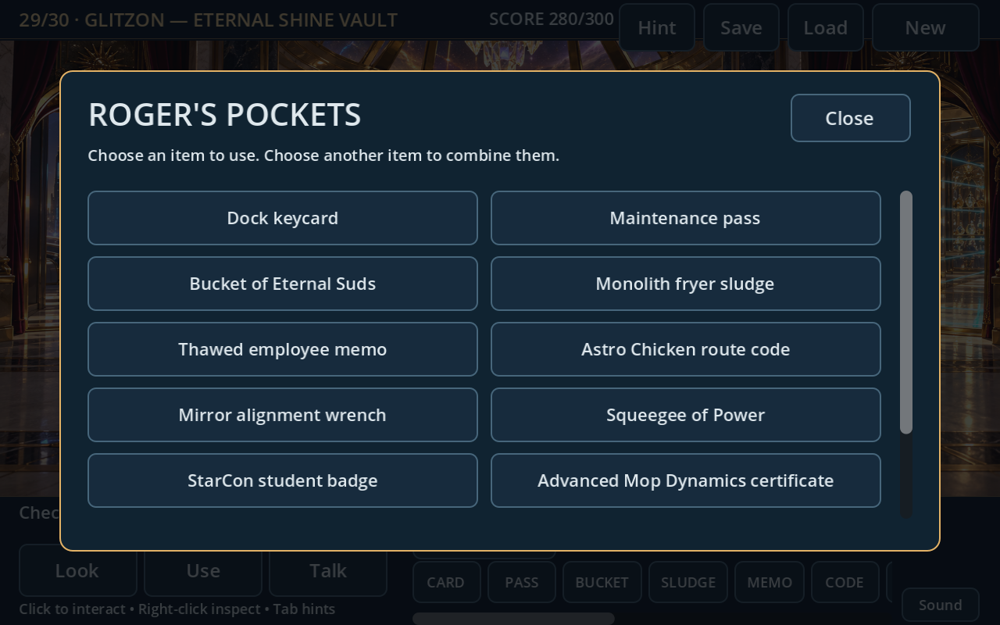

# Space Quest VII — Mopocalypse Now

A complete playable 2D point-and-click fan adventure inspired by Space Quest: **30 illustrated locations**, a connected six-artifact story, and a **300-point finale**. Click the floor to walk, objects to interact, and characters to talk. Explore Labion, Monolith Burger, Plexi, StarCon Academy, Polysorbate LX, and Glitzon before confronting Roger’s clone.

This build follows the supplied story outline with new playable puzzles and dialogue. It implements the whole route and ending; the dialogue is an adaptation rather than a verbatim production script. The detailed room artwork and regional soundtrack are original. The title uses the supplied SQ5 fanfare and SQ6 intro recording.

## Play on Windows

1. [Download the Windows game ZIP](https://github.com/vernlouw/SQ/releases/latest/download/SpaceQuestVII-Windows.zip).
2. Extract the entire ZIP into a folder.
3. Double-click **SpaceQuestVII.exe**.
4. Choose **New Game** or **Continue**.

Godot is not required for this download. Artwork, music, and game data are embedded in the executable. The export targets Windows 10/11 on x86-64, with an OpenGL 3.3 graphics driver. Playing requires no external services or credentials. The exported game pack passes the full 457-check campaign route using Godot on Linux, including all thirty rooms and the 300-point ending. Native Windows launch remains unverified.


## Thirty playable locations

Every location has its own illustrated background, a walkable floor, and clickable interactions. Title screens, navigation menus, and flight scenes are additional views and do not count toward the thirty.

| Region | Playable locations | Preview |
| --- | --- | --- |
| Orbital station — 3 | Astro-Burger diner, Service Dock 7, Arcada Memorial Museum | [Dock](preview.png) |
| Labion — 5 | Landing dock, jungle path, marsh crossing, tribal gate, ancient shrine | [Labion](preview-labion.png) |
| Monolith Burger — 5 | Restaurant, shuttle berth, kitchen, freezer, arcade | [Restaurant](preview-monolith.png) |
| Plexi — 5 | Dock, service plaza, mirror gallery, control room, artifact vault | [Mirror gallery](preview-plexi.png) |
| StarCon Academy — 5 | Dock, cadet hall, classroom, simulator, science lab | [Classroom](preview-starcon.png) |
| Polysorbate LX — 3 | Dock, market, salvage alley | [Market](preview-polysorbate.png) |
| Glitzon — 3 | Dock, boulevard, luxury vault | [Boulevard](preview-glitzon.png) |
| Finale — 1 | Clone’s chamber | [Chamber](preview-clone.png) |

The opening station puzzles lead to a real landing on Labion at 100 points. Recover five legendary cleaning tools across the planets, sabotage the clone’s machine, and reclaim the Mop of Destiny to complete the adventure at 300. Shuttle routes unlock as the story progresses; the station and Monolith Burger remain available for return trips.

For the complete room manifest, puzzle sequence, and ending, see the [full story and walkthrough](docs/STORY_30_SCREENS.md) **(spoilers)**.

## Controls

- **Left-click the floor:** walk automatically, including while an item or action is selected.
- **Left-click a character or object:** approach and perform its usual action, such as talking, inspecting, collecting, operating, or entering a doorway.
- **Right-click an object:** inspect it. **Right-click empty floor** or **Esc:** clear the selected item/action.
- **Inventory:** click an item, then its room target. Click another inventory item to combine them. Click the selected item again to deselect it. Scroll the pocket strip or press **I** / click **Pockets** for the full inventory grid; choosing an item closes the grid.
- **Look, Use, Talk:** optional action overrides. Talk applies to characters; scenery keeps its normal contextual action. Click the active action again to restore automatic interaction. Keyboard: **1** automatic, **2** Look, **3** Use, **4** Talk.
- **Shuttle:** click the shuttle at a dock, choose an unlocked destination, then fly there. **Cancel** or **Esc** closes navigation. **Click, Enter, or Space** skips a flight to its arrival. Inventory and puzzle progress travel with Roger.
- **Comic failure:** click **Retry**, or press **Enter** / **Space**, to resume the same room with your items and progress intact.
- **Tab:** show available hotspots. **Sound** or **M:** music, effects, ambience, and mute controls. **Esc** closes the current popup.
- **F5:** save. **F9:** load. The on-screen buttons also save, load, and start a new game.
- **Title:** New Game starts the story; Continue restores your checkpoint. **Enter** or **Esc** skips the title recordings and starts a new adventure.

There is one local save slot in Godot’s per-user application data directory. Save from a playable room after closing navigation, the full inventory, or a failure popup and finishing any flight. Loading or starting a new game cancels transient menus and flights. Older opening-demo checkpoints remain compatible: their 100-point ending becomes completed chapter-one progress, with the full campaign still ahead.



## Explore for fun

The original station and restaurant have **19 extra props** with jokes, repeat responses, saved toggles, and small visual reactions: suspicious coffee, a sticky seat, a spare helmet, a museum starship model, a mascot, and more. Each of the 26 additional rooms has a further optional object or hazard. Right-clicking inspections is read-only; using the wrong puzzle item leaves it in your pockets.

Take the museum’s souvenir badge and show it to Bex, Voss, the archive guardian, or Flipp. Some campaign hazards cause a comic failure with Retry. The regular prop jokes and souvenir badge do not award main-story points.

At Monolith Burger, talk to **Flipp** and click the restaurant order terminal or counter for an optional **three-order relief shift**. Each ticket offers three answers; a wrong choice gives a hint and another try, with no timer. Completing the shift awards one **COUPON**. Use it on Flipp to redeem the staff meal. Closing and reopening the popup or saving/loading preserves the ticket and reward history; completed shifts cannot issue duplicate coupons. This optional quiz is separate from the kitchen, freezer, and arcade puzzles in the main campaign.

[Relief-shift screenshot](preview-burger.png) · [Comic failure and Retry](preview-death.png) · [Portrait dialogue](preview-dialogue.png) · [Shuttle flight](preview-flight.png)

## Sound

The adventure includes **35 audio cues**: ten original regional scores, ten looping ambiences, thirteen sound effects, and two supplied title recordings. Regional room changes replace the current loops. Footsteps alternate while Roger walks and stop during dialogue, menus, flights, and failure scenes. Music, effects, ambience, and mute preferences save automatically.

The room music and effects were newly synthesized for this project in a retro science-fiction style. The playable story text has no voice-over; advancing dialogue plays a quiet interface cue. The supplied intro recording may contain its original recorded voices.

The title plays the supplied **SQ5 opening fanfare** (about 19 seconds), followed by the full **SQ6 intro recording** (about 5 minutes 33 seconds). They received a light loudness and EQ remaster with their content and running times preserved. Choosing New Game or Continue, or pressing Enter or Esc, skips the remaining recordings and starts the room score. Both play once; their natural completion leaves the title menu open.

Matching WAV or OGG files in [`assets/audio/custom`](assets/audio/custom/README.md) can override individual cues locally. Unsupplied cues keep their included originals. `intro_fanfare.wav`/`.ogg` and `intro_theme.wav`/`.ogg` override the title recordings. Missing title cues are skipped; the menu remains usable even with both absent. No emulator DLLs or game resource archives need to be copied into the Godot project.

[Title screenshot](preview-title.png)

## Development and verification

For editable source, [download the repository ZIP](https://github.com/vernlouw/SQ/archive/refs/heads/main.zip) and extract it. Open **Godot 4.4.1**, choose **Import**, select `project.godot`, then open the project and press **F5**. Keep `assets` and `scripts` beside `project.godot`.

The project uses Godot **4.4.1** and its Compatibility renderer. The final source validation passes **1,499 checks** across seven suites:

| Suite | Passing checks | Coverage |
| --- | ---: | --- |
| Opening gameplay | 88 | Automatic walking, actual clicks, inventory puzzles, chapter-one continuation, old saves |
| Audio | 392 | All 35 cues, regional loops, software-mixer PCM, footsteps/events, overrides, settings, title recordings and sequence |
| Optional room props | 314 | Reachability, read-only inspection, repeat jokes, badge, saved state, wrong items, character-only Talk |
| Burger shift | 81 | Real choices, retries, unique coupon, redemption, persistence, modal input, rendered layout |
| Shuttle travel | 81 | Outbound/return routes, gates, flight skipping, modal input, preserved progress, chapter-one landing |
| Full campaign | 457 | Actual visits to all 30 rooms, regional puzzle gates, six artifacts, comic failures/Retry, 300-point ending and restored narration |
| Campaign interface | 86 | Large inventory scrolling/grid, item selection, modal guards, Retry, full ending text and button geometry |

All thirty rooms were rendered and visually reviewed. The audio checks verify actual decoded samples and nonzero output from Godot’s software mixer, including silence while muted; they do not verify a physical speaker device. The full campaign test follows the real connected route and confirms each room has its own imported illustration, walkable floor, and interactions. It also checks wrong-item preservation, idempotent rewards, academy exits matching their signs, and saved intermediate and completed adventures.

Run from the project folder, substituting your Godot executable:

```sh
/path/to/Godot --headless --editor --path . --quit
/path/to/Godot --headless --audio-driver Dummy --path . --script tests/smoke.gd
/path/to/Godot --headless --audio-driver Dummy --path . --script tests/audio_smoke.gd
/path/to/Godot --headless --audio-driver Dummy --path . --script tests/room_bits_smoke.gd
/path/to/Godot --headless --audio-driver Dummy --path . --script tests/travel_smoke.gd
/path/to/Godot --headless --audio-driver Dummy --path . --script tests/campaign_smoke.gd
/path/to/Godot --audio-driver Dummy --path . --script tests/burger_shift_smoke.gd
/path/to/Godot --audio-driver Dummy --path . --script tests/campaign_ui_smoke.gd
```

Use separate `XDG_CONFIG_HOME`, `XDG_CACHE_HOME`, and `XDG_DATA_HOME` directories on Linux: the suites exercise the real save slot and preferences. The burger and campaign-interface suites require a graphical display to check real font and button geometry. On CI, use `xvfb-run -a env LIBGL_ALWAYS_SOFTWARE=1 /path/to/Godot --audio-driver Dummy --path . --script tests/campaign_ui_smoke.gd` (or the burger script). Those two suites reject `--headless`; the other five run headlessly.

`tests/capture.gd` captures actual rendered views with a graphical display:

```sh
/path/to/Godot --path . --script tests/capture.gd -- --room=labion_jungle --output=/tmp/labion.png
/path/to/Godot --path . --script tests/capture.gd -- --all-rooms --output-dir=/tmp/sq-rooms
```

All thirty room IDs in the [manifest](docs/STORY_30_SCREENS.md) are supported. `--title`, `--sound`, `--portrait`, `--bits`, `--burger`, `--travel`, and `--flight` select additional views. `--interact=<hotspot-id>` captures an interaction. `--load` uses your current checkpoint, and `--inventory` opens its full pockets grid. Batch screenshots render room fixtures; the campaign test independently verifies actual traversal and puzzle completion.

## Current scope

The full outlined adventure is now playable through its ending: thirty illustrated rooms, regional shuttle travel, a connected six-artifact quest, contextual walking and interactions, inventory puzzles, dialogue and hints, comic failures with Retry, optional prop jokes and a burger job, save/load compatibility, a large inventory interface, regional music and ambience, sound effects, persistent audio controls, and the supplied title recordings.

This is a first complete playable build. Character animation remains simpler than the detailed backgrounds. Further polish can add richer animation, longer bespoke music, voiced playable dialogue, and more varied comic failure presentations. The artwork is original and AI-assisted. Native Windows verification remains outstanding.

[Full ending screenshot — spoilers](preview-finale.png)
